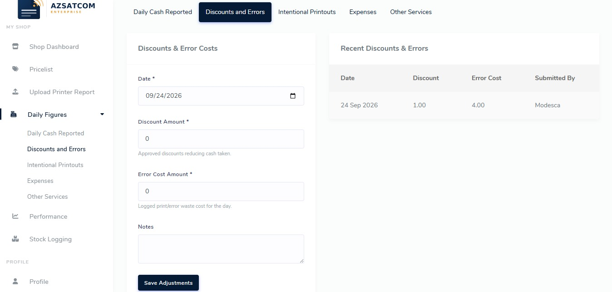
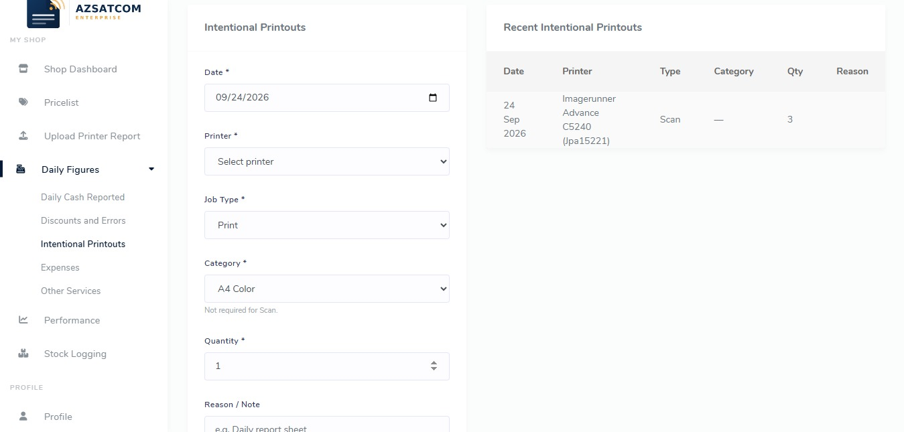
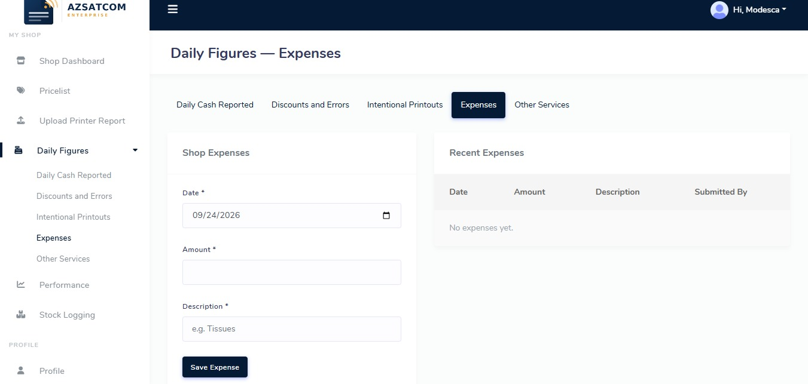
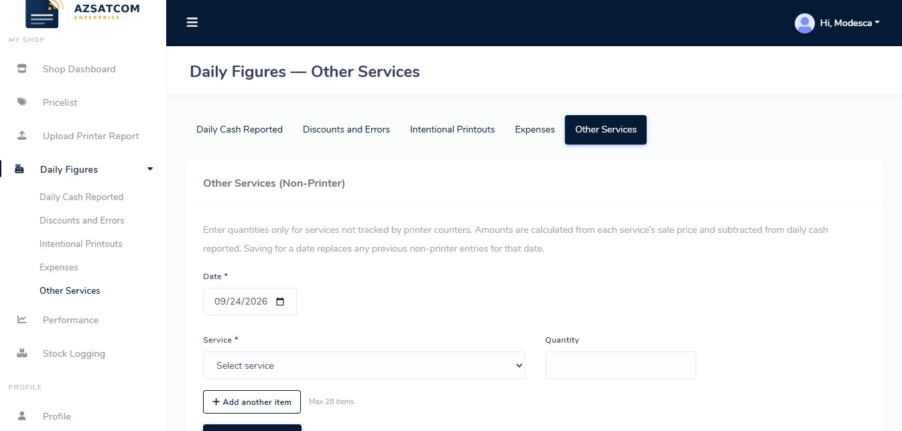

# What people see on screen

Same business. Two journeys — because the owner and the shop floor need different chapters of the story.

---

## The owner’s chapter

The owner opens reconciliation and analytics when they want the plot of the last days or weeks:

- How much we **expected** vs how much was **reported**  
- How wide the **gap** is, on average  
- Whether reports are **missing**  
- Whether **stock or alerts** need a look  

They can filter by shop or look across all three, watch the trend of expected against reported, see which **services** are carrying revenue, and export or print a report when accounting needs a paper trail.

When they need to dig into a messy day, **reconciliation** lays out the full cast: cash, discounts, errors, expenses, intentional printouts, other services — so a variance isn’t a mystery, it’s a checklist.

Behind the curtain (still owner/admin tools): expected figures after counters land, a place to **review odd printer jobs** before they harden into “truth,” a log of CSV uploads, and a **baseline reset** when a printer’s story has to restart cleanly after missed days.

---

## The shop floor’s chapter

Staff don’t need the full executive novel. They need to **finish today’s page**:

1. **My shop** — where they are assigned, which printers matter, what’s been uploaded lately  
2. **Upload the printer report** — so machine reality enters the story  
3. **Daily figures** — cash, discounts and errors, intentional printouts, expenses, other services  
4. **Shop performance** — a simple expected-vs-reported view for *their* location  

That’s enough to replace the old paper sheet without turning every cashier into an accountant.

### Daily figures — the new paper sheet

---

## A day in two acts

**Evening.** Forms are in. The owner can already see sales and costs for the day that just closed.

**Morning.** Counter reports arrive. Expected production refreshes. The owner looks again — does the till still match the machines?

That double beat is the product: not a monthly autopsy, a **daily conversation with the numbers**.
