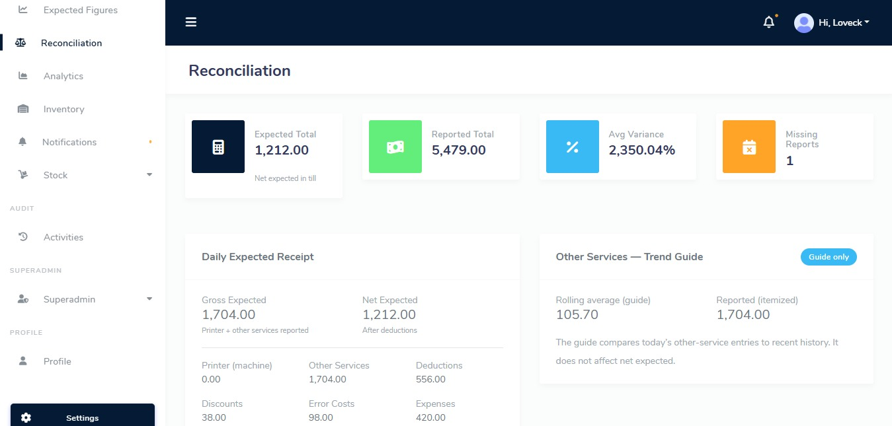
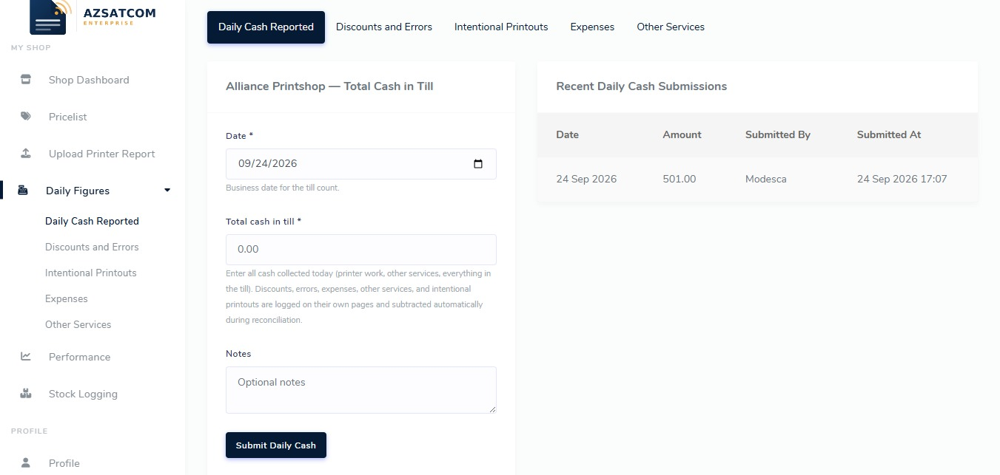
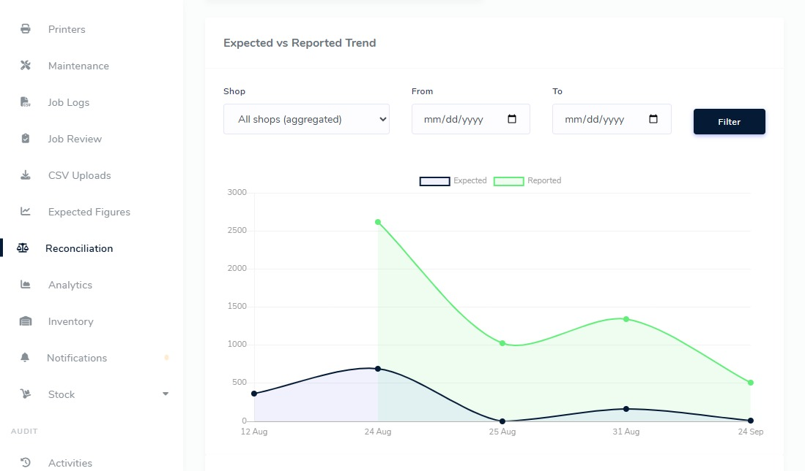

# Print shop operations — a portfolio story

Three busy shops. Paper reports. An owner who couldn’t trust yesterday’s numbers.

**I designed how each day gets recorded, structured it in a database, and built a web dashboard so sales, costs, and performance stop living in notebooks — and start living in a story the owner can open before lunch.**

Monthly accounting went from roughly **24 hours to about 4**.

---

## Why this mattered

When the manager or owner wasn’t on site, paper sheets didn’t travel well. Revenue versus spending was fuzzy. Staff performance felt like opinion. Disputes followed. Salaries waited on accounting that couldn’t keep up.

The person who needed the truth most was the **owner**.

---

## What changed

| Then | Now |
|------|-----|
| Daily paper sheets | One shared digital record |
| “We’ll reconcile when someone’s back” | Close-of-day view + morning refresh when printer counters land |
| Arguments about what was sold | Expected vs reported, by shop and by service |
| Accounting as a monthly scramble | A shorter, calmer close |

---

## How the story flows

**Capture the day honestly** — shop totals, service mix, cash, expenses, discounts, inventory, waste, and every printer output (including scans). Intentional work is marked so it isn’t mistaken for billable sales.

**Bring it into one place** — automatic CSV drops from shop PCs, plus staff forms on the website, into SQL.

**Show the owner the plot** — dynamic web dashboards and reports: what the business *should* have taken in versus what was *reported*, where the gap is, which shop and services matter, and when stock or missing reports need attention.

When a few days of counter readings went missing, a **baseline reset** restarted the daily calculation from solid ground instead of leaving the dashboard stuck.

---

## Outcomes that stick

- Yesterday’s sales and costs visible **by close of day**, then again after **next-morning** counter uploads  
- Payroll easier because daily expectations are clearer  
- Fewer fights about what a shop sold  
- Accounting time: **~24 hrs → ~4 hrs** a month  

---

## My role

I shaped the **daily process**, **cleaned and structured the data**, and **built the living dashboard and reports**.

---

## Walk the story

| Chapter | File |
|---------|------|
| Full narrative | [01-case-study.md](./01-case-study.md) |
| What the numbers mean (no jargon wall) | [02-metrics-glossary.md](./02-metrics-glossary.md) |
| What the owner and staff each see | [03-dashboard-sitemap.md](./03-dashboard-sitemap.md) |
| From shop floor to screen | [04-data-pipeline.md](./04-data-pipeline.md) |
